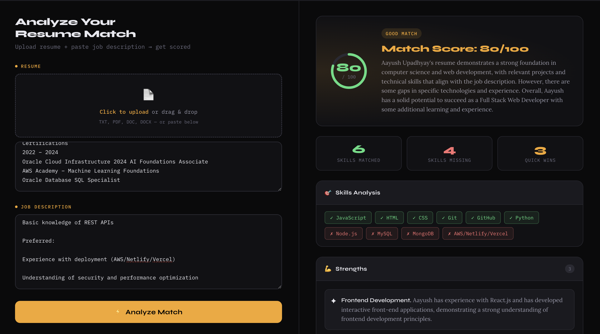
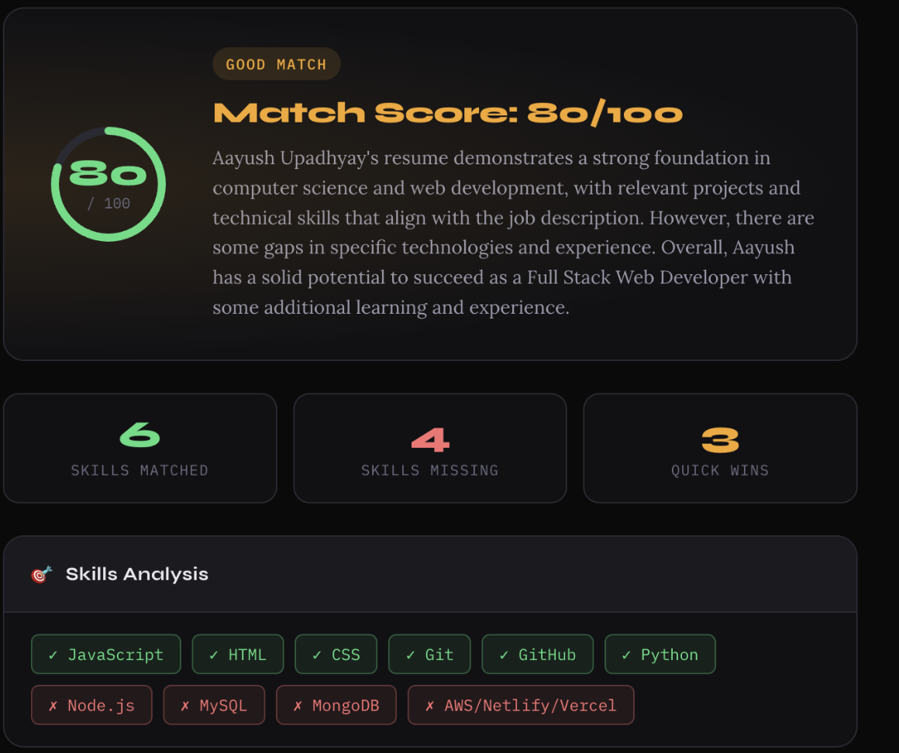
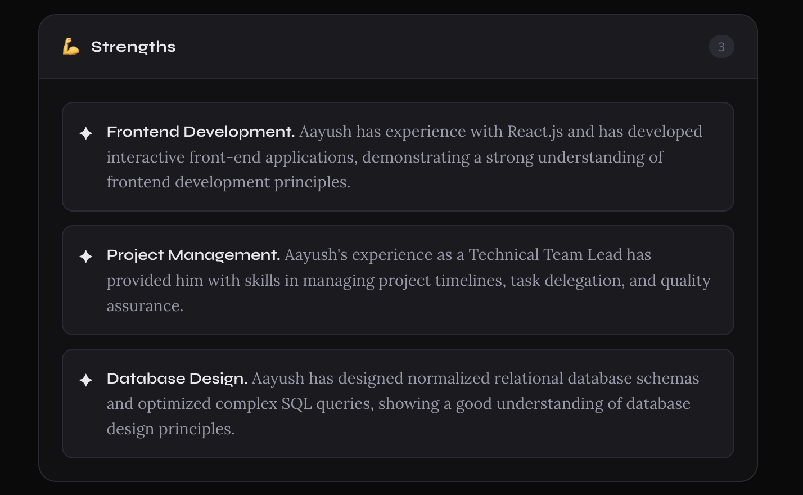
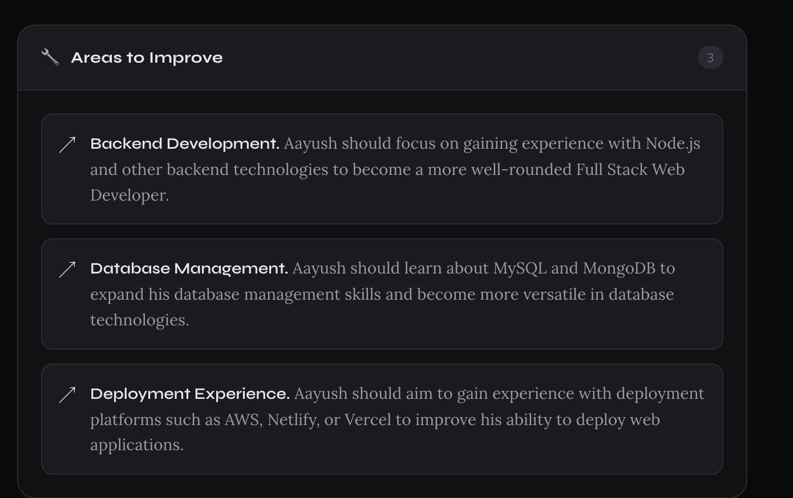

# 🎯 ResumeAI — AI Resume Analyzer

An AI-powered resume analyzer that scores how well your resume matches a job description and gives you actionable improvement tips.



## ✨ Features

- 📄 **Upload your resume** — drag & drop PDF or paste text directly
- 📝 **Paste any job description** — works with any role or company
- ⚡ **Instant AI analysis** — powered by Groq (Llama 3.3 70B)
- 📊 **Match score** — get a score out of 100 with a visual ring
- 🎯 **Skills analysis** — see matched vs missing skills at a glance
- 💪 **Strengths** — know what's working in your resume
- 🔧 **Areas to improve** — specific, actionable feedback
- ⚡ **Quick wins** — small changes with big impact
- 🔍 **ATS keyword gaps** — keywords missing for applicant tracking systems

## 📸 Screenshots

| Main Interface | Results |
|---|---|
|  |  |

| Strengths | Improvements |
|---|---|
|  |  |

## 🚀 Live Demo

👉 [Try it here](https://resume-analyzer-aayush.vercel.app)

## 🛠️ Tech Stack

- **React** + **Vite** — frontend framework
- **Groq API** (Llama 3.3 70B) — AI analysis
- **PDF.js** — PDF text extraction
- **Vercel** — hosting & deployment

## 🏃 Run Locally

1. Clone the repo:
```bash
git clone https://github.com/Aayush-25/resume-analyzer.git
cd resume-analyzer
```

2. Install dependencies:
```bash
npm install
```

3. Create a `.env` file:
```
VITE_GROQ_API_KEY=your_groq_api_key_here
```

4. Start the dev server:
```bash
npm run dev
```

5. Open [http://localhost:5173](http://localhost:5173)

## 🔑 Get a Free API Key

Get a free Groq API key at [console.groq.com](https://console.groq.com) — no credit card required.

## 📄 License

MIT — free to use and modify.

---

Built with ❤️ by [Aayush Upadhyay](https://github.com/Aayush-25)
